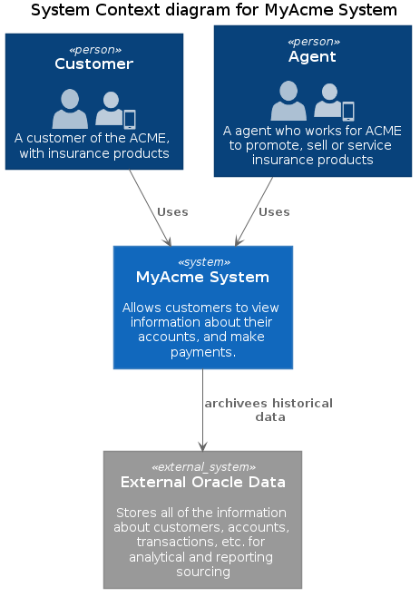
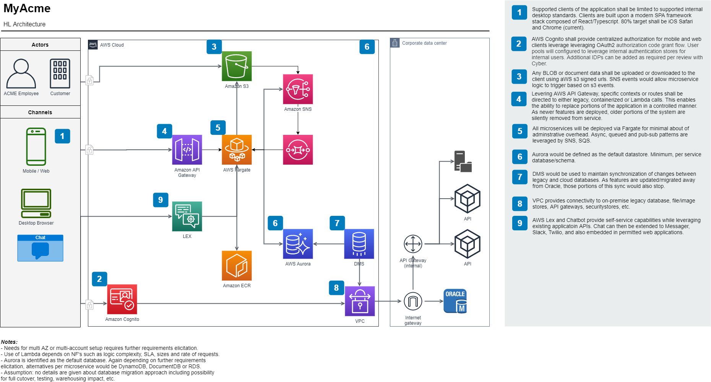

# MyAcme Architectural Roadmap

The following document presents an architecural plan for the MyAcme application. 

## Background

ACME CORP. has an existing digital asset called MyACME consisting of a web portal and mobile web app. It’s 2-3 year old, heavily utilized, but is not meeting the needs of the company. A $2 million investment to enhance the asset has been approved. 

## Problem/Context

MyACME is large application (registration, login, billing, FNOL, Premium Audit) for the Bond division.  The business wants to eventually expand its usage by rolling it out to their commercial and personal LOBs.  The code utilizes a large shared Oracle database that has been a known bottleneck, infrastructure and technology are aging, and major new features must be added (List below).

The following is a list of identified high-level requirements or features for consideration:

- **Add New functionality:** move from custom to corporate UX design system
- **Add New functionality:** intuitive customer experience across ACME lines of business
- **Add New functionality:** embedded chat channel for communications
- **Change functionality:**   data persistence options
- **Change technical:**         currently hosted on-premise with the direction leverage public cloud where effective
- **Future technology:**       enable feature toggle, a/b testing, blue/green or canary deployments

## New Features

### UX and UI Design System

Currently, ACME leverages a custom design system. This creates certain known negatives such as:

- Significant effort creating and testing new UI/UX metaphors and components
- Reduced velocity and increased risk when integrating with other enterprise products
- Inconsistency creates frustration and impacts customer experience

#### Proposal

- Migrate to [React Material Web Components](https://rmwc.io/) and develop necessary library to match Corporate Style/UX.
- Leverage Storybook to define a catalog of components
This will allow designers and developers to simplify developments, encourage reuse and create a consistent approach to decomposing designs and composing components, modules and applications.
- Define styles via Theming to create a consistent means of enforcing component theming where applicable.
- Storybook source will be maintain in the common/shared components repo, for example, [repository](https://github.com/cduplantis/acme-storybook) whereas the viewable storybook site will be accessible on [GitHub pages as in this example](https://cduplantis.github.io/acme-storybook/). We will also have the ability to natrually push to an CloudFront enabledS3 bucket with  enabled.

#### Assumptions

- Corporate UX only has a style guide and no existing library of existing usable components for React (or Angular) exist.

### Chat System

Need for an "embedded chat channel for communications"

#### Proposal

- Elicit supported intents needed from business
- Using AWS (Lex)[https://docs.aws.amazon.com/lex/latest/dg/what-is.html] and Lambda, create a Chatbot with the desired workflows to the supported intents identified by business.
- Deploy the chatbot to the web application
- Optionally, deploy the bot to the supported additional channels such as FaceBook Messenger
- Potentially, work with IVR/Telephony and Mobile teams to leverage Lex logic to call center and mobile platforms.
'

## Changed Features

### Database

Currently, MyAcme utlizies an Oracle database system which has been identified as a significant contributor to low SL of the application.

#### Proposal

- Establish a 12 factor pattern, by which, each microservice is responsible for a given context of data and is responsible for the storage of that data.
- Storage and retreival of this data is the sole responsibility of the service. No database-to-databse integrations are allowed as part of an longterm archtiecture.
- AWS DMS will be used to provide a means, where necessary, of synchronizing data from the legacy databases into the cloud envionrment. Additonal, Lambda, Glue or other similar ETL processes may be necessary.
- Microservices will leverage SNS and SQS as a means of notifiying other contexts of datachanges.

### Currently hosted on-premise with the direction leverage public cloud where effective

Multiple factors are driving the business to migrate to a cloud-based architecture.

- Exchange capital expense for variable expense
- Lower cost at AWS economies of scale
- Dynamic, demand-driven capacity
- Increased speed and agility for deom and deploy
- Lower operating costs than data centers
- Go global in minutes

Naturally, certain factors are limiting the adoption of that change.

- Resiliency: ensuring AWS architected applications meet the known (and undefined) SL's/KPIs met by business today while lowering cost
- Analytics: Logging, auditing and monitoring capabilities must continue to be meet. Things are radically different in the cloud. Integration with existing business risks teams must be defined.
- Costs: costs in the cloud may be more expensive during transtition. Solutions must be modeled, [calculated](https://cloud.netapp.com/tco-calculator) and [managed](https://aws.amazon.com/aws-cost-management/aws-cost-and-usage-reporting/).

#### Proposal

- Define an accounts for production and non-production AWS accounts for low and medium risk applications.
- Define multple accounts for production and non-production AWS accounts for low and medium risk applications.
- Define appropriate AWS Roles necessary for developers to administrate non-production

#### Assumptions

- Existing applications have the capability of running or being run within a containerized environment as Docker containers.

## Enablers / Future

### Feature Toggle

As we move to fewer repos, CICD and a faster release cycle, it is necessary to permit the release to production, code that is disabled or otherwise enabled based upon a singular flag or otherwise a programmatic strategy. This is well defined [enterprise pattern defined by Martin Fowler](https://www.martinfowler.com/articles/feature-toggles.html) permits developers to integrate their code more frequently while ensuring that such releases are not limited or constratined by the business' desire to release (Release on Demand).

#### CICD vs Release on Demand

#### Proposal

- Source and vendor [Launch Darkly product](https://launchdarkly.com/) capaable of meeting the following known requirements:
  - Ability to run at large scale
  - Updatable on the flow with application restarts
  - Reportable/auditable
  - Centralized view/dashboard for intra/extra porfolio users and operations teams
  - Fine-grained access control
  - Abililty to define boolean and multivalued flags, with optional TTLs, capable of operating on server and client applications across multple environments and projects
  - Ability to compare and promote flags
  - Capability to test or view a resultant set of flags for a given user.
  - Targeting flag assignment by users groups, canary environments, or custom definitions.
